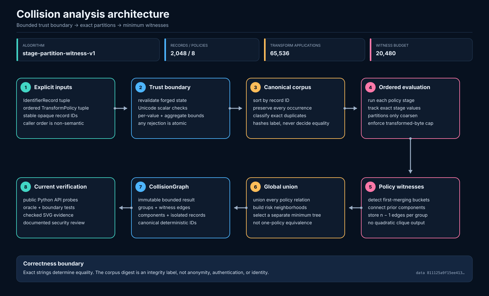
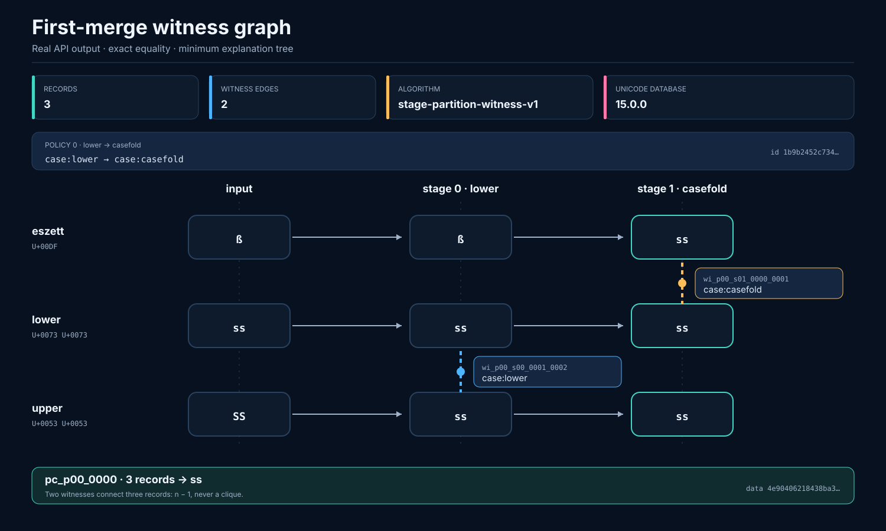
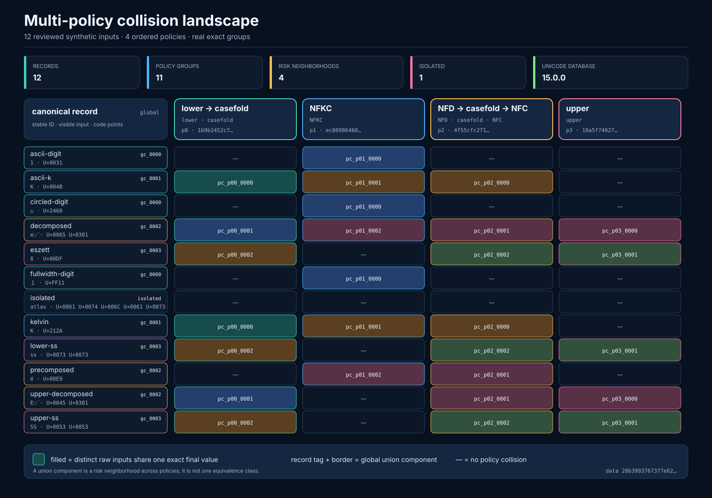

# Casefold Observatory

Casefold Observatory is a dependency-free Python laboratory for explaining how
explicit Unicode normalization and case policies merge identifiers. It is built
for security review of usernames, routing keys, dataset labels, package names,
and other namespaces where an unexpected equivalence can become an
authorization or integrity problem.

> **Phase 2a is implemented:** the installed library validates bounded in-memory
> records, evaluates one or more ordered policies, and returns deterministic
> collision groups, connected components, and minimal stage witnesses. File
> ingestion, portable receipts, a CLI, and an offline UI remain future work.

It is not a generic case converter, a confusable-character detector, or a claim
that one Unicode policy is universally correct.

## Why this problem matters

Unicode-aware identifier handling is not equivalent to calling `lower()`.
Lowercasing and case folding differ; NFC, NFD, NFKC, and NFKD make different
trade-offs; and changing operation order can change the resulting equivalence
classes. Two services can therefore disagree about whether identifiers are
distinct even when both are "Unicode aware."

Casefold Observatory makes the policy explicit and records the first stage at
which previously separate values become exactly equal. Equality is always
decided from complete Python strings, never from hashes.

## Implemented capabilities

- ordered NFC, NFD, NFKC, NFKD, lower, upper, and case-fold operations;
- policies bound to the active runtime Unicode database version;
- exact duplicate occurrences preserved and classified separately;
- deterministic record ordinals derived from unique canonical record IDs, so
  record tuple order is non-semantic;
- per-policy collision groups with a minimal witness tree;
- cross-policy union components with a separate deterministic minimal tree;
- byte, code-point, stage-expansion, aggregate-work, transformed-data, group,
  witness, and component limits;
- atomic, redacted analysis failures with separate input, canonical-record, and
  policy ordinals;
- explicit reject or preserve handling for controls, format characters, and
  bidirectional controls;
- no runtime dependencies and no network requirement.

The architecture and current graph semantics are illustrated with
source-controlled, reproducible assets:







See the [visual evidence index](docs/visuals/README.md) for the exact public
fixtures, embedded hashes, and byte-for-byte regeneration commands. The formal
invariants, minimality argument, ordering rules, and limits are documented in
[the collision graph contract](docs/collision-graph-contract.md).

## Setup and verification

Casefold Observatory supports Python 3.11 and newer.

```bash
python3 -m venv .venv
.venv/bin/python -m pip install -e ".[dev]"
```

Run the same local gates used to review this phase:

```bash
.venv/bin/python -m ruff check .
.venv/bin/python -m ruff format --check .
.venv/bin/python -m mypy src tests scripts
.venv/bin/python -m coverage erase
.venv/bin/python -m coverage run --branch -m unittest discover -s tests
.venv/bin/python -m coverage report -m
.venv/bin/python scripts/render_collision_visuals.py --check
.venv/bin/python scripts/verify_distribution.py
```

The authoritative result is the output of these commands at the checked-out
revision. The project configuration enforces its current coverage threshold;
the README deliberately does not freeze a test count that changes as boundary
cases are added.

The committed visual bundle binds Unicode database 15.0.0 and is reproduced in
CI on Python 3.12. The installed package is also tested on Python 3.11, 3.13,
and 3.14. Those runtimes execute the full engine and static visual-contract
tests, while the two exact evidence-replay tests report an explicit skip when
their `unicodedata.unidata_version` differs. Policy IDs include that version by
design, so silently treating cross-version bytes as equivalent would be wrong.

## Public API example

This example is executable against the current in-memory API. The input order is
intentionally shuffled; canonical record IDs determine the returned ordinals.

```python
from casefold_observatory import (
    TransformStep,
    analyze_collisions,
    create_identifier_record,
    create_policy,
)

records = (
    create_identifier_record("upper", "SS"),
    create_identifier_record("eszett", "ß"),
    create_identifier_record("lower", "ss"),
)
policy = create_policy((TransformStep.LOWER, TransformStep.CASEFOLD))
graph = analyze_collisions(records, (policy,))

print(graph.record_ids)
print(graph.policy_groups[0].member_record_ordinals)
for witness in graph.witnesses:
    print(
        witness.left_record_ordinal,
        witness.right_record_ordinal,
        witness.stage_index,
        witness.step.value if witness.step else None,
    )
print(graph.components[0].witness_tree_ids)
```

Output:

```text
('eszett', 'lower', 'upper')
(0, 1, 2)
1 2 0 case:lower
0 1 1 case:casefold
('wi_p00_s00_0001_0002', 'wi_p00_s01_0000_0001')
```

At stage 0, lowercasing connects `ss` and `SS`. At stage 1, case folding
connects `ß` to that existing component. The three-member group therefore needs
two witnesses, not all three pairwise edges.

## How the collision graph works

1. Records are validated, sorted by unique record ID, and assigned canonical
   ordinals. Every occurrence is retained, including exact duplicates.
2. Policies retain caller order. Each record is evaluated at every ordered
   transformation stage under fixed per-value and aggregate budgets.
3. Exact duplicate occurrences receive their own witnesses before policy work.
4. Within a final collision bucket, each stage partitions records by exact
   output. When a bucket joins `k` previously separate components, the analyzer
   emits exactly `k - 1` deterministic first-merge edges.
5. A policy group containing `n` records consequently has `n - 1` witnesses:
   enough to explain connectivity without producing a quadratic clique.
6. All exact and per-policy edges are unioned into global risk neighborhoods. A
   separate deterministic tree explains each neighborhood.

A global component is **not** an equivalence class under one policy. For
example, policy A can connect records 1 and 2 while policy B connects records 2
and 3. The union component contains all three, but records 1 and 3 need not be
equal under either policy. Stage indices are meaningful only inside their own
ordered policy; stages from different policies are not chronological.

## Determinism, evidence, and privacy

The graph carries the algorithm identifier, runtime Unicode version, policy
IDs, and a domain-separated, length-prefixed SHA-256 digest of the canonical
in-memory record model. That semantic digest is an integrity handle for this
model only. It is not a digest of source-file bytes and provides no
authentication, anonymity, or freshness.

The current diagrams are regenerated from reviewed repository inputs and
describe implemented behavior. They are not UI screenshots or evidence of a
CLI. Future screenshots, terminal captures, GIFs, or videos will be added only
after the corresponding surface exists, with generation commands and
non-sensitive public fixtures. Speculative mockups are not used as proof.

`repr=False` keeps raw identifiers, record IDs, and transformed values out of
ordinary dataclass representations, but it is not a privacy boundary.
Attributes, `dataclasses.asdict`, serialization, debuggers, caller-owned
objects, and traceback frame locals can still expose them. Do not analyze or
commit private namespace exports without an appropriate data-handling plan.

## Current roadmap

1. **Bounded transformation policies** — implemented.
2. **In-memory collision graph and minimal witnesses** — implemented in phase
   2a; portable graph serialization is next. The checked-in documentation
   fixtures are generator-owned evidence, not a public receipt format.
3. **Reproducible ingestion and receipts** — bounded streaming input,
   deterministic serialization, and receipts tied to exact input bytes,
   policies, implementation version, and Unicode data version.
4. **Command-line workflow** — safe terminal rendering, inspectable output, and
   reproducible evidence capture.
5. **Offline interface** — local-only assets, escaped visible rendering of
   controls and invisible code points, and a restrictive Content Security
   Policy.
6. **Interactive evidence** — real screenshots and a GIF or short video once an
   implemented interaction warrants them.

The historical Flask case-conversion prototype remains in Git history for
provenance. It is unsupported and must not be deployed: it used a development
server and a remote runtime asset.

## Security

Unicode input and generated analytical results are sensitive, untrusted data.
Read [SECURITY.md](SECURITY.md) before integrating the library or publishing an
artifact.

## License

[MIT](LICENSE)
