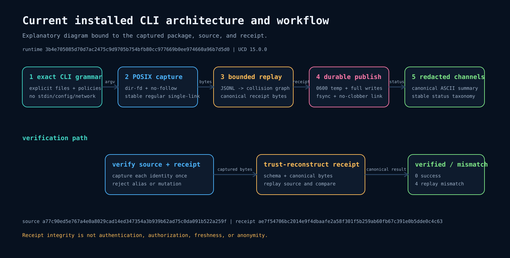
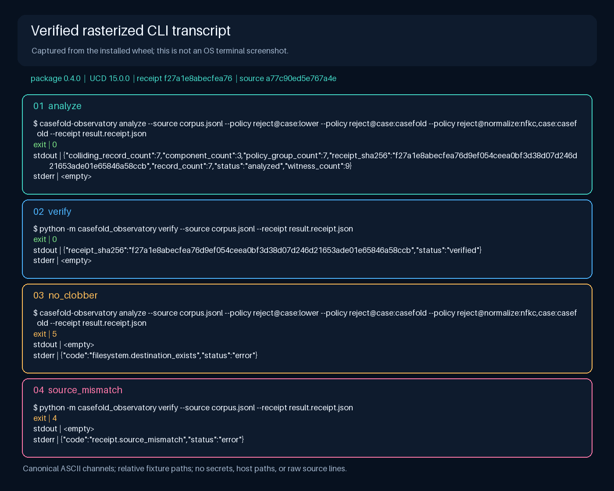
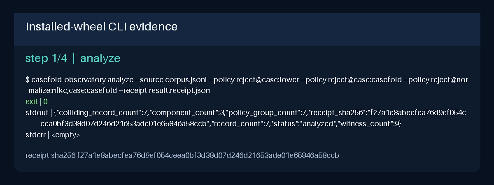
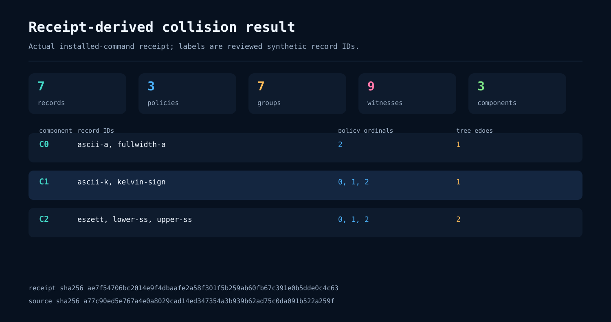

# CLI Evidence

This directory contains the reviewed six-file evidence bundle for the installed
`casefold-observatory` 0.5.0 workflow. The media is generated from real command
channels and a real canonical receipt produced from the public seven-record
fixture. It is not a UI mockup, benchmark, OS terminal screenshot, or claim about
identifiers outside that fixture.

## Gallery

### Installed-wheel setup and verification path



This explanatory SVG identifies the isolated wheel under test, the fixed
renderer, temporary runtime files, safe file checks, byte comparison, and human
visual-review boundary.

### Captured terminal channels



This is a verified rasterization—not an operating-system screenshot. The panels
preserve captured argv, stdout, stderr, and exit status for successful analysis,
successful replay, no-clobber rejection, and changed-source rejection.



The GIF presents the same four observed phases as deterministic full-canvas
frames. It loops for documentation convenience; the command data is taken from
the manifest rather than simulated by an animation.

### Receipt-derived result



This SVG projects the stored receipt: 7 records, 3 explicit policies, 7
per-policy collision groups, 9 minimal witnesses, and 3 cross-policy components.
It does not rerun the analyzer or infer facts absent from the receipt.

## Provenance

The capture and adoption chain is immutable and machine-readable:

| Field | Reviewed identity |
| --- | --- |
| Capture source commit | `7ac811b8070cc7f3c7aa9caeeb9e3dddb082879b` |
| Capture source tree | `dc2c320291a1166efd1d77893959df340d780479` |
| Workflow run / attempt | [`31331354478` / `1`](https://github.com/omar07ibrahim/case/actions/runs/31331354478) |
| Workflow job | [`93290069024`](https://github.com/omar07ibrahim/case/actions/runs/31331354478/job/93290069024) |
| Hosted artifact | `generated-cli-evidence-31331354478-1`, ID `9043023742` |
| Artifact archive | `187895` bytes, SHA-256 `a600d916bdb1b1e0ffc15acc94d14895b4c93b99ad6ba9bc2bff4cd1853beb59` |
| Adoption commit | `a0caad6a912166fe11df7888a6cf9db1a8c28abb` |
| Canonical adoption record | [`evidence/cli-evidence-adoption.v1.json`](evidence/cli-evidence-adoption.v1.json) |
| Capture manifest | [`evidence/cli-evidence.v1.json`](evidence/cli-evidence.v1.json) |
| Synthetic fixture | [`fixtures/cli-demo.v1.jsonl`](fixtures/cli-demo.v1.jsonl), SHA-256 `a77c90ed5e767a4e0a8029cad14ed347354a3b939b62ad75c0da091b522a259f` |

The hosted archive was independently checked for exact inventory, regular
`100644` entry modes, manifest and receipt consistency, source bindings, media
structure, privacy markers, and visual completeness before its bytes were
adopted. The durable adoption record carries that review outcome and archive
identity; availability of the temporary hosted artifact is not required to
verify the committed bundle.

The six adopted file identities are:

| File | Bytes | SHA-256 | Role |
| --- | ---: | --- | --- |
| [`cli-demo.gif`](cli-demo.gif) | 45,779 | `97d1609b3f8da9aa3cd4c09e5e5d4d975f7bf39ff7ad98e7b2dc77a80a9e16b3` | Four captured phases |
| [`cli-result.svg`](cli-result.svg) | 6,582 | `3acb8bde0875154bdd23766c0e8432462fe30fafda8293fe4f3afd288d83da25` | Receipt-derived result |
| [`cli-transcript.png`](cli-transcript.png) | 108,918 | `2661e81bf5bb789d88c738e2b661bf72091ff75d7185874edeef41f7eda5e4e0` | Rasterized command channels |
| [`cli-workflow.svg`](cli-workflow.svg) | 9,610 | `a10a42cfb18d33505d7c1816db1d1c1ba1fed52e7ae5c70e4ef112688092e807` | Explanatory workflow |
| [`evidence/cli-demo.receipt.v1.json`](evidence/cli-demo.receipt.v1.json) | 6,905 | `ae7f54706bc2014e9f4dbaafe2a58f301f5b259ab60fb67c391e0b5dde0c4c63` | Real canonical receipt |
| [`evidence/cli-evidence.v1.json`](evidence/cli-evidence.v1.json) | 9,067 | `713d3af791a27d0fe1aa1e718e96ada3853169347f2af6622552d1d7104d7cd4` | Capture manifest |

This README is an index and is deliberately not a seventh artifact member.

## Reproduce and verify

Exact reproduction requires Linux x86-64, CPython 3.12.3 with Unicode database
15.0.0, and the repository revision being checked. Pillow is a hash-locked
documentation tool, not a package runtime dependency.

From the repository root:

```bash
test "$(python3.12 -c 'import platform; print(platform.python_version())')" = "3.12.3"
test "$(python3.12 -c 'import unicodedata; print(unicodedata.unidata_version)')" = "15.0.0"

work="$(mktemp -d)"
trap 'rm -rf "$work"' EXIT
python3.12 -m venv "$work/renderer-venv"
"$work/renderer-venv/bin/python" -m pip install \
  --require-hashes \
  -r requirements/cli-visuals.txt
"$work/renderer-venv/bin/python" -m pip install \
  build==1.5.0 \
  packaging==26.3 \
  pyproject-hooks==1.2.0 \
  setuptools==83.0.0

mkdir -p "$work/source" "$work/wheel"
git archive HEAD | tar -x -C "$work/source"
(
  cd "$work/source"
  SOURCE_DATE_EPOCH=315532800 \
    "$work/renderer-venv/bin/python" -m build \
      --wheel \
      --no-isolation \
      --outdir "$work/wheel"
)

wheels=("$work"/wheel/*.whl)
test "${#wheels[@]}" -eq 1
python3.12 -m venv "$work/cli-venv"
"$work/cli-venv/bin/python" -m pip install \
  --no-index \
  --no-deps \
  "${wheels[0]}"

"$work/renderer-venv/bin/python" scripts/render_cli_evidence.py check \
  --venv-bin "$work/cli-venv/bin" \
  --wheel "${wheels[0]}"
git diff --exit-code
test -z "$(git status --porcelain --untracked-files=all)"
```

`check` creates two fresh temporary captures, audits both, requires them to be
byte-identical, then audits and compares the six committed files. It does not
overwrite the adopted evidence. The pinned CI implementation is in
[`.github/workflows/ci.yml`](../../.github/workflows/ci.yml).

## Update discipline

Do not hand-edit, optimize, re-encode, or substitute any of the six outputs. If a
bound runtime source, fixture, renderer, dependency, or capture environment
changes, create a new candidate; compare two fresh captures; review command
channels, receipt semantics, media structure, accessibility, privacy, and
clipping; then adopt the reviewed bytes with a new canonical provenance record.
Captions and hashes must change in the same documentation phase.
